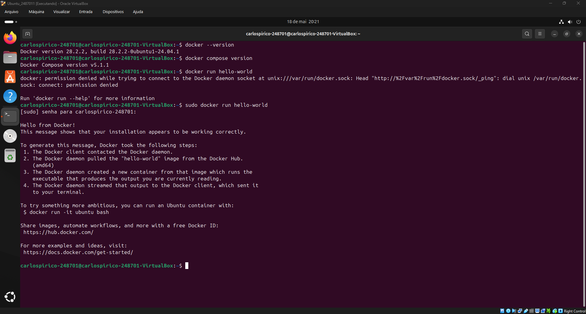
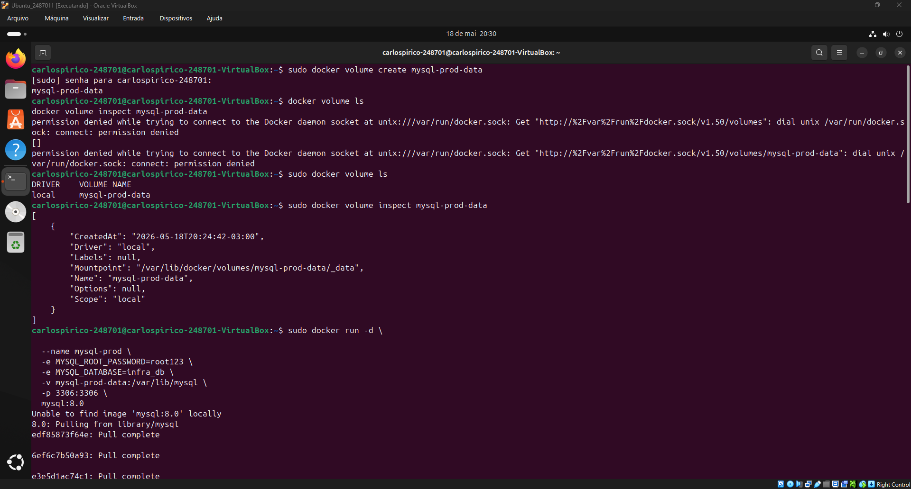
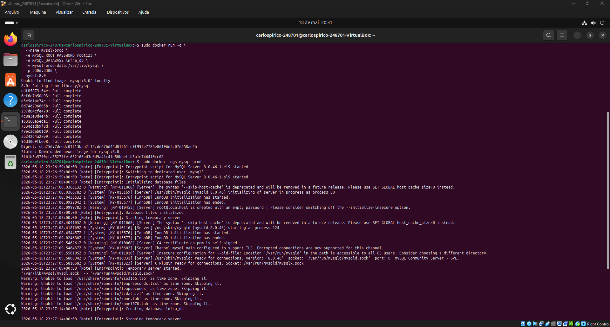
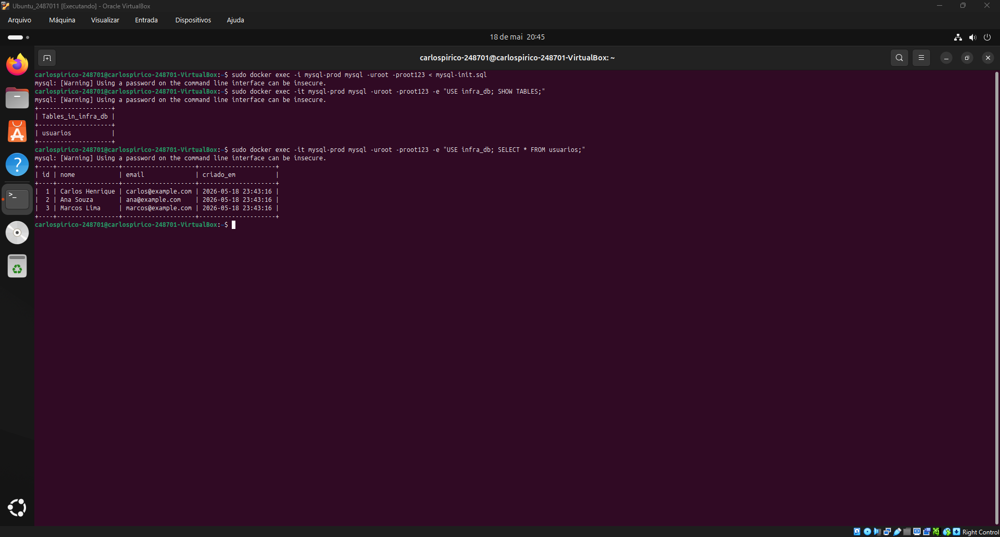
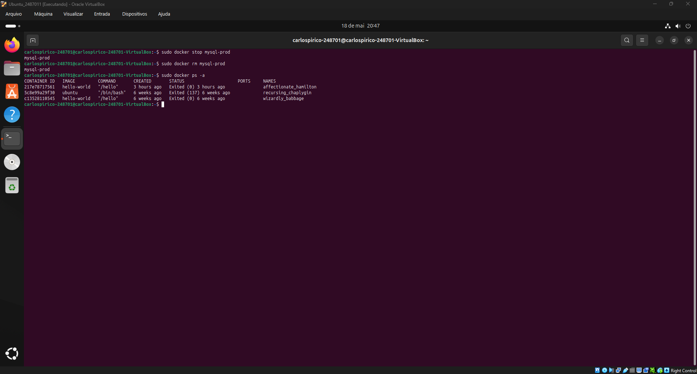
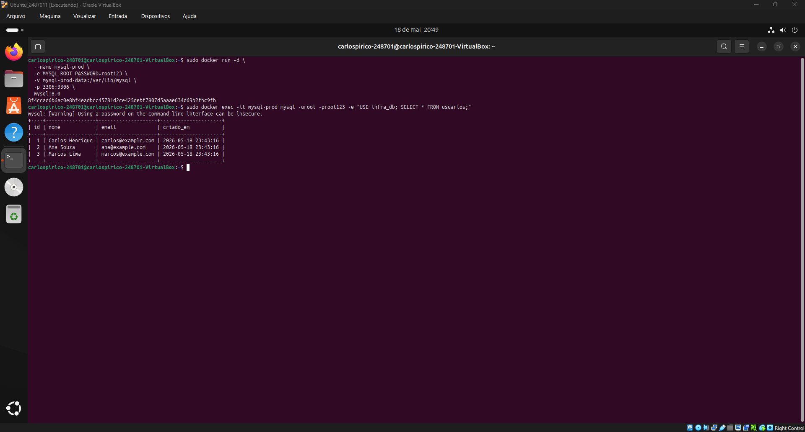

# Infraestrutura e Serviços de TI — Persistência de Dados com Docker

## Introdução

A persistência de dados é um conceito fundamental em ambientes containerizados, pois permite que informações importantes sejam mantidas mesmo após a remoção ou recriação de containers.

Por padrão, containers são considerados efêmeros. Isso significa que eles podem ser criados, executados, parados e removidos rapidamente. Porém, quando os dados são armazenados apenas dentro do sistema de arquivos interno do container, eles podem ser perdidos ao remover esse container.

Para resolver esse problema, o Docker oferece mecanismos de persistência, como Docker Volumes e Bind Mounts. Os volumes permitem armazenar dados fora do ciclo de vida do container, sendo gerenciados pelo próprio Docker. Já os Bind Mounts permitem montar diretórios do sistema operacional host diretamente dentro do container.

Nesta atividade, o objetivo é compreender e validar, na prática, diferentes formas de persistência de dados utilizando Docker. A atividade também envolve backup, restauração, compartilhamento de volumes entre containers e automação básica por meio de scripts Bash.

---

## Ambiente Utilizado

- Sistema Operacional: Ubuntu Linux
- Docker Engine: Docker version 28.2.2, build 28.2.2-0ubuntu1~24.04.1
- Docker Compose Plugin: Docker Compose version v5.1.1
- Hardware:
  - Processador: 4 núcleos
  - Memória RAM: 6144 MB
  - Armazenamento utilizado: 25 GB

## Desenvolvimento da Atividade
### Cenario 1

Antes do início da atividade, foram executados os comandos obrigatórios para validar o ambiente:

```bash
sudo docker --version
sudo docker compose version
sudo docker run hello-world
```



---

Criar e validar o volume.

```bash
sudo docker volume create mysql-prod-data
sudo docker volume ls
sudo docker volume inspect mysql-prod-data
```



Criar e Validar container MySQL com o volume.

```bash
sudo docker run -d \
  --name mysql-prod \
  -e MYSQL_ROOT_PASSWORD=root123 \
  -e MYSQL_DATABASE=infra_db \
  -v mysql-prod-data:/var/lib/mysql \
  -p 3306:3306 \
  mysql:8.0
```

```bash
sudo docker ps
sudo docker logs mysql-prod
```



Copiar script para dentro do container:

```bash
sudo docker cp mysql-init.sql mysql-prod:/mysql-init.sql
```

Executar o script de criacao e insercao de dados:

```bash
sudo docker exec -i mysql-prod mysql -uroot -proot123 < mysql-init.sql
```

Validar os dados:

```bash
sudo docker exec -it mysql-prod mysql -uroot -proot123 -e "USE infra_db; SELECT * FROM usuarios;"
```



Remover container:

```bash
sudo docker stop mysql-prod
sudo docker rm mysql-prod
```

Confimar container removido:

```bash
sudo docker ps -a
```



Recriar container usando o mesmo volume.

```bash
sudo docker run -d \
  --name mysql-prod \
  -e MYSQL_ROOT_PASSWORD=root123 \
  -e MYSQL_DATABASE=infra_db \
  -v mysql-prod-data:/var/lib/mysql \
  -p 3306:3306 \
  mysql:8.0
```

Validar os dados:

```bash
sudo docker exec -it mysql-prod mysql -uroot -proot123 -e "USE infra_db; SELECT * FROM usuarios;"
```



---

### Cenario 2